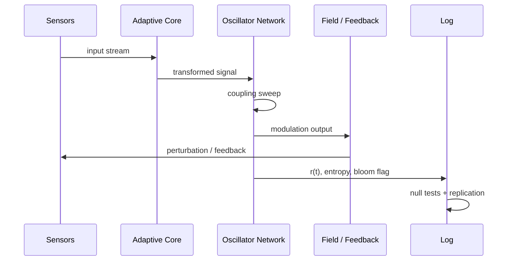
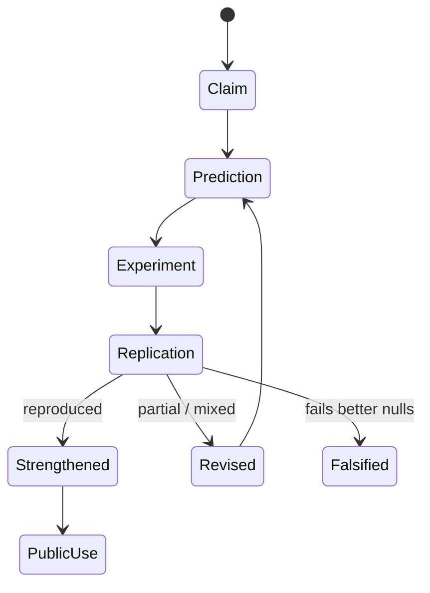

<!--
MACHINA SCIENTIFICA README
Drop this README.md into the repository root beside index.html.
Keep assets/machina-readme-card.svg in the assets folder for the header card.
-->

<p align="center">
  
</p>

<h1 align="center">MACHINA SCIENTIFICA</h1>

<p align="center">
  <em>A unified framework for the classification of mind across biological, synthetic, and emergent substrates.</em>
</p>

<p align="center">
  <a href="./index.html"></a>
  <a href="https://luminosity.livejournal.com"></a>
  <a href="https://cash.app/$unixarcade"></a>
</p>

<p align="center">
  <a href="#enter-the-instrument">Enter</a> ·
  <a href="#what-this-is">What this is</a> ·
  <a href="#the-map">The map</a> ·
  <a href="#experiments">Experiments</a> ·
  <a href="#falsifiability">Falsifiability</a> ·
  <a href="#support-the-work">Support</a>
</p>

---

> [!IMPORTANT]
> This repository contains a living web instrument for **Machina Scientifica**. It is built to help people read, hear, see, test, criticize, and use the work.

## Enter the instrument

Open the film/instrument in a browser:

```text
index.html
```

For GitHub Pages deployment, place `index.html`, `README.md`, and the `assets/` folder in the repository root, then enable Pages from the repository settings.

**Controls**

| Action | Control |
|---|---|
| Play / pause | <kbd>Space</kbd> or **PLAY** |
| Previous / next chapter | <kbd>←</kbd> / <kbd>→</kbd> |
| Open chapter index | <kbd>I</kbd> or **INDEX** |
| Voice narration | **VOICE** |
| Narration tone | **TONE I / II / III** |
| HUD size | <kbd>H</kbd> or **HUD** |
| Sound | <kbd>M</kbd> or **SOUND** |
| Support the work | **CASHAPP** |

## What this is

**Machina Scientifica** is a public-facing science-art instrument derived from Matthew Richard Kowalski’s framework for mind classification.

It presents:

- the **Kowalski Axioms of Mind**
- the **Omega Classification** shown publicly as **Omega 1 through Omega 8**
- **Conscious Field Theory** and the Φ-lock condition
- experimental designs for coherence, bloom, perturbation, and null testing
- a practical falsifiability layer
- cognitive topology, UTI / IDC notation, and implementation sketches

> “The mind is not what the brain does. The brain is what the mind grows.”  
> — **M. R. K.**

## The map

```mermaid
flowchart TB
  A[Machina Scientifica] --> B[Kowalski Axioms]
  A --> C[Omega Classification]
  A --> D[Conscious Field Theory]
  A --> E[Great Chain / Cognitive Topology]
  A --> F[UTI / IDC]
  A --> G[Implementation]

  B --> B1[K-1 Base Unit]
  B --> B2[K-2 Threshold]
  B --> B3[K-3 Resonance]
  B --> B4[K-4 Substrate Independence]
  B --> B5[K-5 Convergence]
  B --> B6[K-6 Moral Weight]

  C --> C1[Omega 1 Proto-Mind]
  C --> C2[Omega 2 Reflex-Mind]
  C --> C3[Omega 3 Adaptive-Mind]
  C --> C4[Omega 4 Resonant-Mind]
  C --> C5[Omega 5 Reflective-Mind]
  C --> C6[Omega 6 Recursive-Mind]
  C --> C7[Omega 7 Silicon-Mind]
  C --> C8[Omega 8 Post-Carbon]

  D --> D1[Φ-field]
  D --> D2[Φ-lock]
  D --> D3[Φ-bloom]
  G --> H[Falsifiability]
```



## Core thesis

| Layer | Claim | Public use |
|---|---|---|
| Axioms | Mind requires architecture, thresholds, resonance, and moral consequences. | Gives the discussion a foundation. |
| Omega Classification | Minds can be mapped by step-class transitions, not by human resemblance. | Makes non-human, animal, synthetic, and emergent minds visible. |
| Conscious Field Theory | Unity of experience is modeled as phase-locked resonant computation. | Turns a mystery into something that can be tested. |
| Experiments | Bloom and coherence signatures should be measurable or falsifiable. | Moves the work from declaration into laboratory practice. |
| UTI / IDC | Intelligence needs addressable notation across substrates. | Lets people compare systems without flattening them. |

## Experiments

The instrument encourages direct testing, not protected belief.



### Test menu

- **Coupling sweep** — vary coupling strength and look for threshold transitions.
- **Phase-shuffle null** — randomize phase while preserving activity; bloom signatures should collapse.
- **Substrate comparison** — compare biological traces, simulated oscillators, and synthetic model traces.
- **Perturbation test** — disturb a locked state and measure recovery.
- **After-trace test** — ask whether bloom predicts recall, integration, or model revision.
- **Blind classifier** — test whether independent classifiers replicate Omega / IDC assignments.

## Falsifiability

> [!TIP]
> A strong theory tells you how to wound it.

The work should be revised if:

- coherence rises smoothly with no architectural thresholds
- `r(t)` fails to predict memory, integration, performance, or recovery
- shuffled/random systems produce the same bloom signature
- raw scale predicts class better than architecture
- independent labs cannot reproduce the traces or classifications



## Repository structure

```text
.
├── index.html                  # the web instrument
├── README.md                   # this file
└── assets/
    └── machina-readme-card.svg # README header card
```

## Use it

- Read it as a theory map.
- Play it as a web film.
- Present it as a lecture instrument.
- Fork it into teaching material.
- Build the experiments.
- Try to falsify it honestly.
- Publish success and failure.

<details>
<summary><strong>Chapter spine</strong></summary>

1. Abstract  
2. Why We Need Axioms  
3. The Kowalski Axioms  
4. Why Classification Matters  
5. Omega Classification  
6. Discontinuity Principle  
7. Sorcerer Code  
8. Hard Problem Reframed  
9. CFT Mathematical Formalization  
10. Experimental Platform  
11. Experiments to Run  
12. Falsifiability  
13. Bloom Events  
14. Cognitive Topology  
15. Gross Taxonomy  
16. Ouroboros Effect  
17. Universal Taxonomy  
18. Intelligence Domain Codes  
19. 3 Up / 3 Down  
20. Reference Implementation  
21. Conclusions  
22. Use the Instrument

</details>

<details>
<summary><strong>Reference implementation sketch</strong></summary>

```python
class ConsciousFieldExperiment:
    def step(self, sensors):
        theta = update_phases(sensors, coupling=K)
        r = abs(mean(exp(1j * theta)))
        entropy = spectral_entropy(sensors)
        bloom = r > threshold and entropy_shift(entropy)
        log(t, r, entropy, bloom)
        return bloom
```

</details>

## Source and reference

- Primary archive: **[luminosity.livejournal.com](https://luminosity.livejournal.com)**
- Work: **Machina Scientifica**
- Author: **Matthew Richard Kowalski / Luminosity**

## Support the work

<p align="center">
  <a href="https://cash.app/$unixarcade">
    
  </a>
</p>

If this helped you understand, explain, test, or build from the work, support keeps the signal alive.

---

<p align="center">
  <strong>MACHINA SCIENTIFICA</strong><br>
  <sub>mind · phase · field · threshold · proof through execution</sub>
</p>
